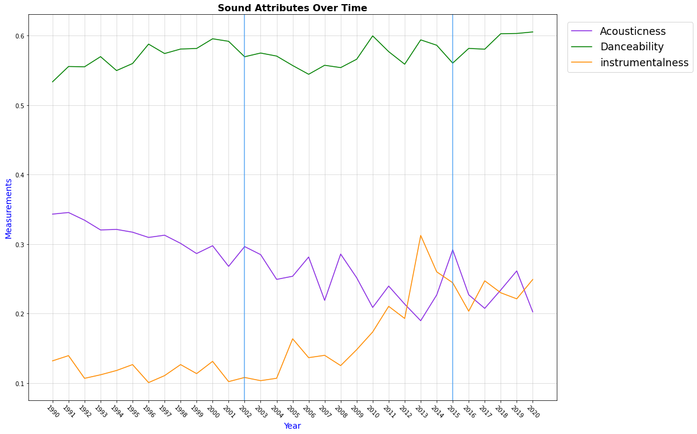

# Project-1-for-Class
# Music of life

## Introduction

Music has been around throughout existence, and everyone listens to music or hears music. From media and advertisement to personal listen music is reaches our ears.  This project looks at some of the measureable changes in music over the last 30 years, such as the most popular genres, the danceability, acoustics and instrumentalness of music.    

## Description of Data

The data used for  project was retrieved from csv files downloaded from kaggle. https://www.kaggle.com/yamaerenay/spotify-dataset-19212020-160k-tracksthis

The songs in the csv files was taken from spotify and formatted in genres before being placed in a list with the applicable measurables for the 30 year stretch. A for loop was used to split the genres in and then drop duplicates due to songs being in the list more than once. After closer examination of the dataset it was decided that the data had several songs with different artists (sometimes as many as 10). Due to the amount of duplicates found it was necessary to condense both the songs and genres for our project.

The spotify data was cleaned by correcting the timing format of danceability in to minutes as it was miliseconds and made for a less than optimal visualization format.

Wtih spotify having so many different genres stored in the data, we worked and consolidated the generes down to 10 for analysis purposes. Each song with dupilicates was first split and expanded to have each each song on its own row and run through a loop to collect a list of unique genres, then after dropping duplicate songs condensing to the songs to one of the major genres we created.  The result made for a more readable analysis.

Even with the changes to the data mentioned above it was still robust, thus we focussed on the last 30 years of genres and measureables.

See applicable data dictionary for more information on the datasets.

when splitting the data we borrowed code from Daniel Himmelstein https://stackoverflow.com/users/4651668/daniel-himmelstein 

### Limitations of the data

Initially, we didnt realize how much data was avaiable on the data sets. It difficulty gathering information on all the measurables and genres.  We also noticed that the csv files get updated ever so often and since its not live data can change the outcome.

We discussed what measurables seemed most relatable to people then decided to focus on those measureables in the data and their respective columns.  

We went with a method that would combine songs in to a general genres which limits the over all varability of the data.

we found that the time was in milliseconds and we had to convert to minutes to make it more visually friendly

The kaggle dataset presented several challenges. First we had to combine the csv files so that we had all the measurements from each csv because the measurables we focussed on were not all in the same csv file. Once we reviewed the columns in the datasets and determine which ones we needed to keep for our project, we isolated the needed measurable columns into a single data set that we  used in our project.  There were more several more measurables we could have explored.  


dropped the duplicate songs from the data set as there were multi songs with several artists

If starting this project again, it is likely that we could focus on the unused measurables in the collection of data.  We could also explore a more extensive genre by either individual or expanded groups instead of the most general in terms of genre 

With more time we could have taken a similar approach to the time frame we used, but, instead, focuses on older music to see how that would of changed the genres and reviewed trends by a different time frame.  

Visualizing relative "popularity" of genres over time. This appears to be useless, possibly because the selection of data from the original dataset was composed mostly of relatively popular songs despite the wide selection of genres and artists - note that each genre is in line with one another.
        
## Analysis/Methodology

### What genres are people listening to? 

To answer the first question, we condensed the overwhelming amount of genres spotify had in the data to more generalized genres


we then took some of our measurables and applied it to the same 


### How Danceable Songs are between 1990 and 2020?

Danceability describes how suitable a track is for dancing.  We measured this from a scale of 0.0 to 1.0 with 0 being the least danceable and 1 being the most danceable.

### How Acoustic Songs are between 1990 and 2020?

Acoustic denotes the level of not having electrical amplification.  we used the same scale from 0 to 1 as above. 

### How Instrumental Songs are between 1990 and 2020?

Instrumental denotes the amount of vocals in a song.  we used the same scale from 0 to 1 as above. 




### Has music become more explicit between 1990 to 2020 ?

Explicit describes the lyrical grammar quality.


 


## Results of Analysis

Overall, over the last 30 years Hip Hop had the most popular songs followed by R&B from spotify data.

Danceability has stayed consistently high over the last 30 years with Hip Hop being the most danceable.  We can see a correlation between popularity as the top genre and most danceable. 

On the other end of the spectrum Classical was by far the most Acoustic and most Instrumental

Finally, based on the analysis of the data, the average number of explicit songs have risen over the last 30 years. We can reasonably predict that the number of explicit songs will continue to rise in the future.  


## Conclusions

We did not expect to find such a diverse genre set within the data.  Spotify has numerous genre and this made our task a bit more complex.  Once we were able to minimize the amount of genre we were able to pin point measurable data that we could compile for our project.  This is only a small portion of the data within the files.
 
While it is not too suprising to find a correlation with Hip hop and danceablity, nor a correlation between Classical and Acoustic or Instrumemntal.  It was suprising to see overall not a significant drop off in danceability between the condensed genre.  


```python

```
